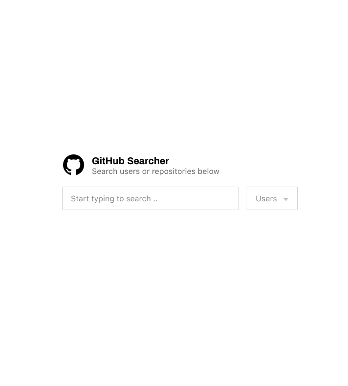
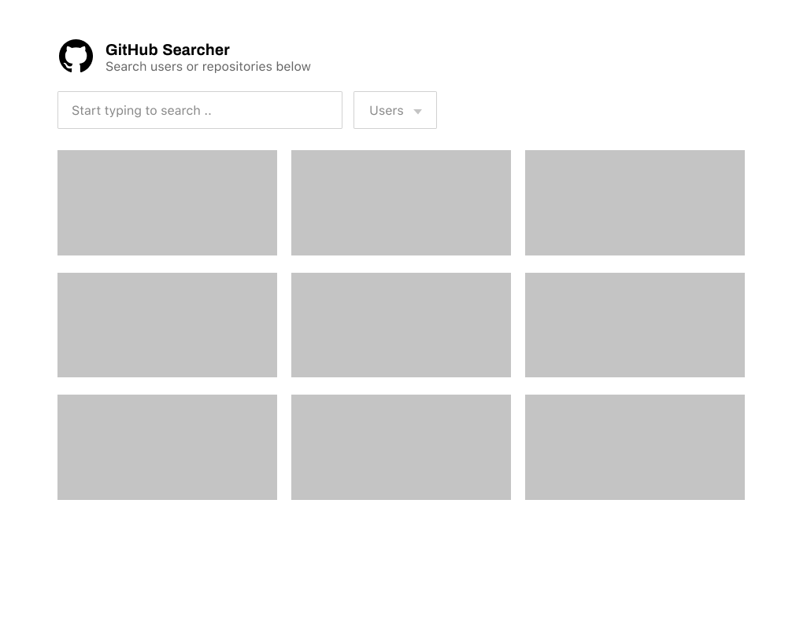
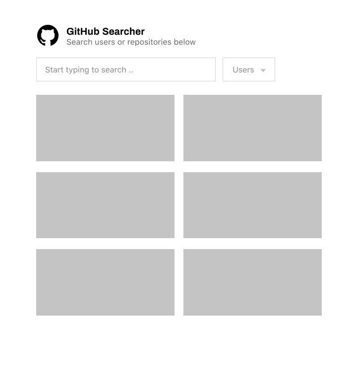

## frontend-task
> Build a GitHub repository search application

This case study aims to assess how you approach a problem starting from the high level solution to the low level implementation details and code quality. You will not be penalized for asking questions, so don't hesitate to ask us if you need any clarification.

## The Task

You are required to build a fullstack single page application built with

* React.js
* TypeScript
* ExpressJs, REDIS
* Redux and [redux-persist](https://github.com/rt2zz/redux-persist)
* [React Router](https://github.com/ReactTraining/react-router)
* Vanilla CSS, Sass, Styled Components or any other CSS-in-JS but no frameworks allowed.

## Backend Requirements

Write an "Search" Backend API endpoint which eventually collect the data from Github & stores it in REDIS.

Create two API Endpoints:
1.  "/api/search"
    - Receives a POST request with search type(**users** or **repositories** or **issues**) & search text(mandatory).
    - The results will be fetched from the GitHub API & cache it for atleast 2 hours.
    * [GitHub Search API Docs](https://developer.github.com/v3/search/)
2.  "/api/search/clearcache" : Clear Backend Caching

Here are some of the items that you should take care of

* Add Caching so that the same request is not called again.
* Write Swagger documentation with clear description, request, response & example for the endpoints
* Write API Flows for unit testing the API using any assertion library such as "SuperTest"

## Frontend Requirements

There will be two input fields, on search field for the user to type the text and a dropdown where user can either pick "User" or "Repository" to define the entities that they want to search. When the user doesn't have any input or clears the input, the input fields should be shown in the middle of the page. The UI could roughly look like below:

When the user starts typing into the input, make an Backend API call to fetch the results and display them in the form of grid below it. The data should be cached in the store and persisted via redux-persist and no more API calls should be made if we already have the results for the search term.

Here are some of the items that you should take care of

* Add debounce (feel free to import from lodash). Make the API calls only if the user has typed 3 or more characters.
* If the user changes the "Entity type" value in the dropdown and user has 3 or more characters in the input already, it should refresh the results.
* If the user clears the input or types less than three characters, clear the results and show the empty screen.

The UI for the results could roughly look like below. The design for repository and user cards are up to you.

For each repository display the repository user details returned from API and the repository name, author, stars and other statistics below it. For the users, show the profile picture, name, location, any other data you have and link to their profile.

On smaller screens (width <= 768px), the grid will be 2 columns and it could look like below:

Consider all the states: initial, loading, error,... and inform the user about it.

## Criteria

Your work will be evaluated primarily on:

* Cleanliness of the code
* Use modern ES6+ syntax, async/await, elegant & readable code
* All the edgecases have been handled
* Typescript definitions, types, interfaces.
* `README.md` file explaining your high level solution and any decisions you made and the reasons behind them
